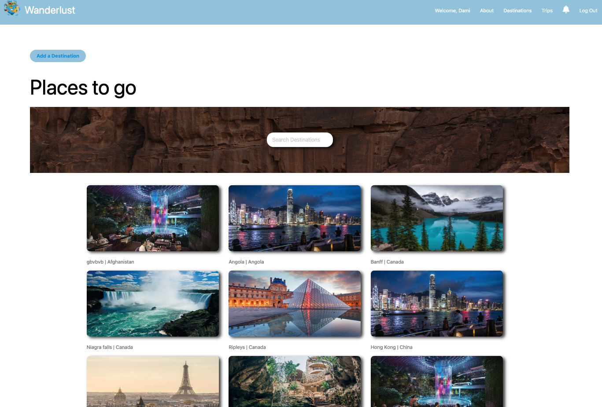
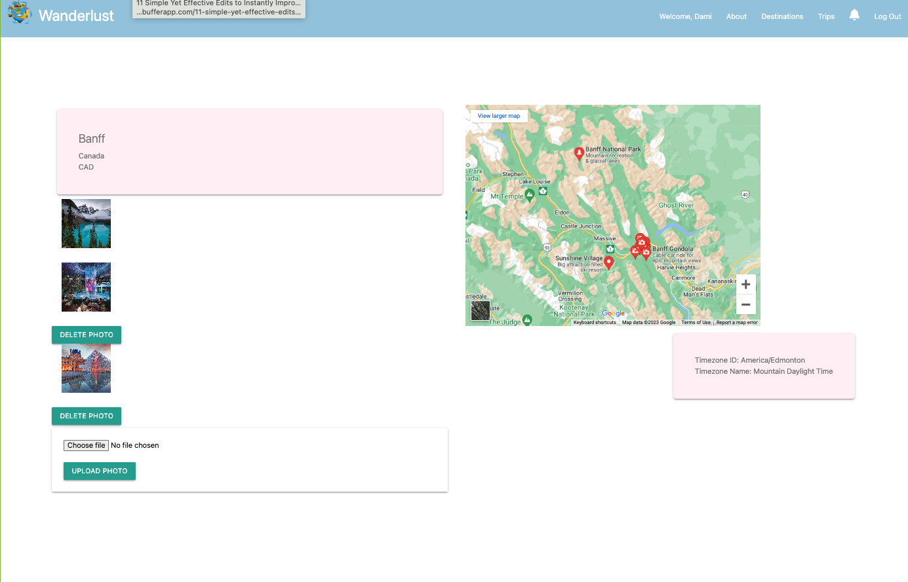
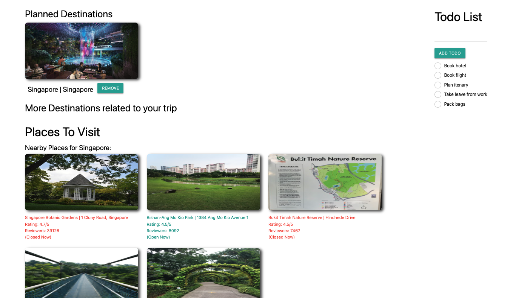
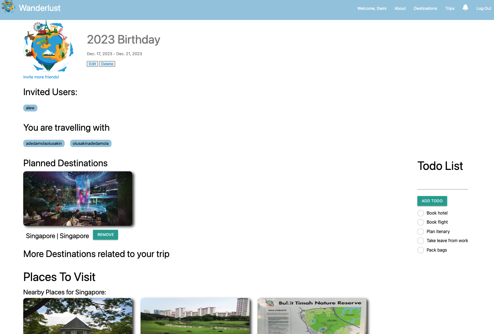
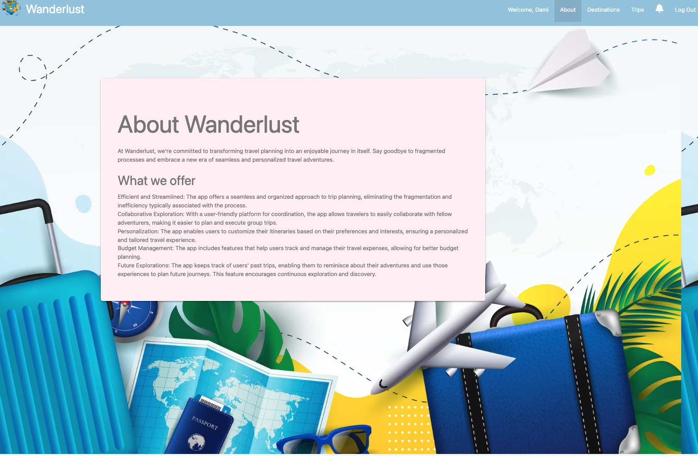
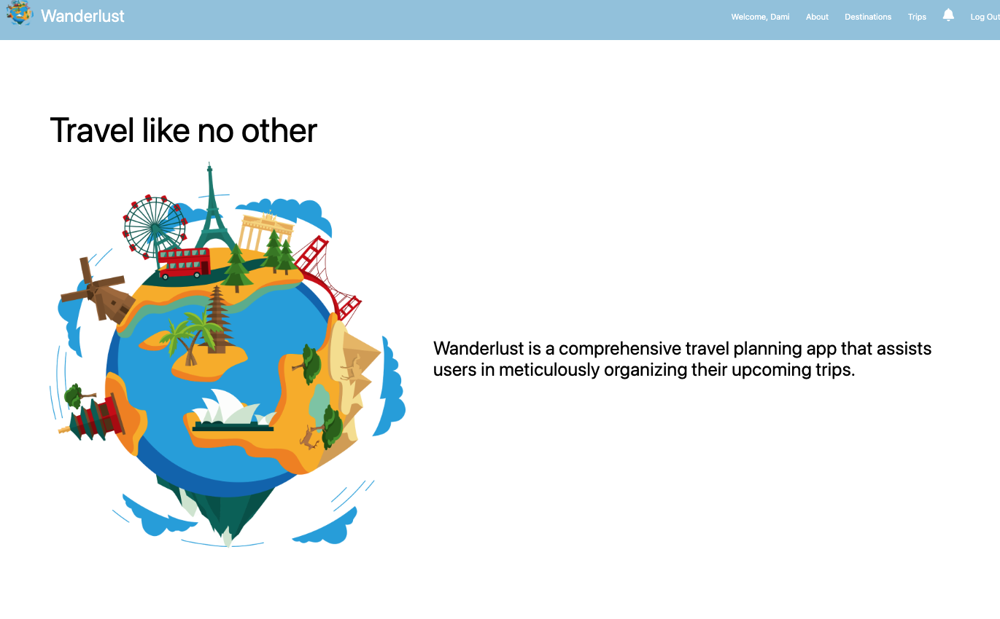
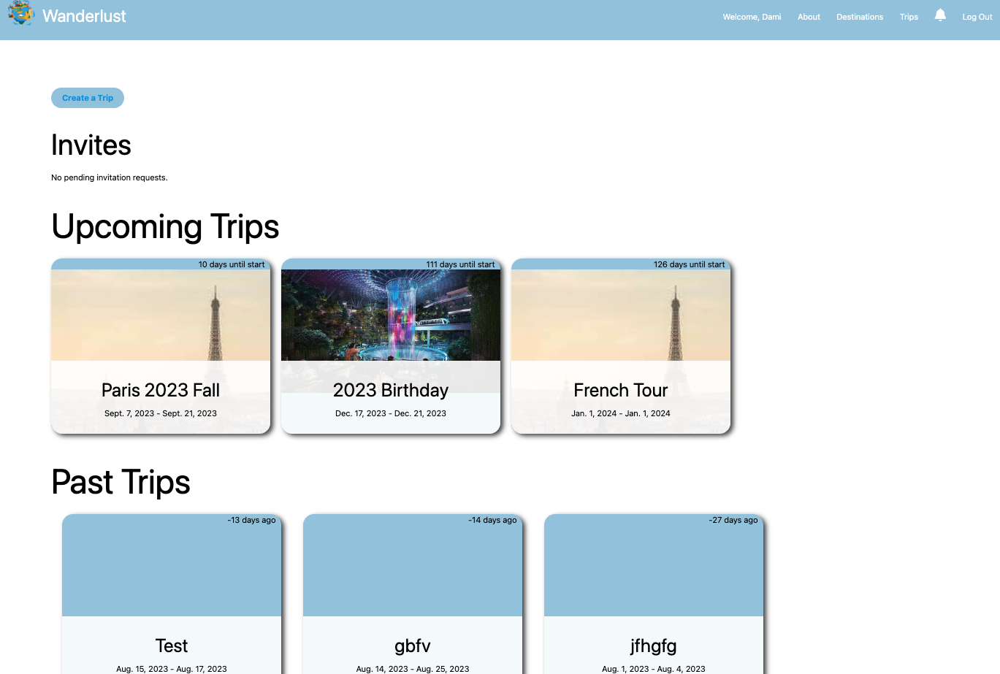
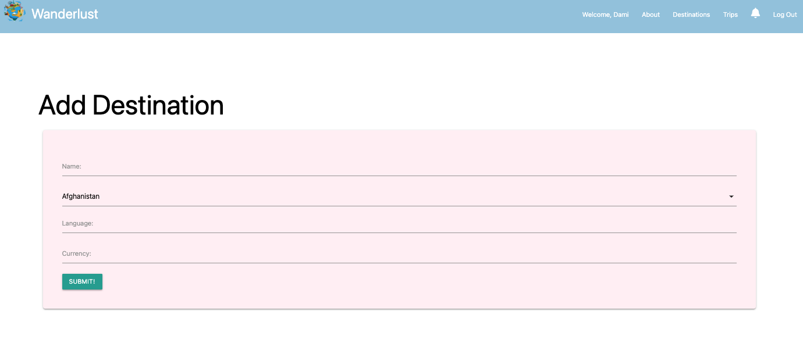

# ga_capstone_prjct_wanderlust
# About
Wanderlust is a comprehensive travel planning app that assists users in meticulously organizing their upcoming trips.

# Team
- Sofi, Andrew, Ryan, Damola

# Technology used
- Python
- Django
- CSS
- JavaScript
- HTML
- Google places API
- Github
- Fly.io
- MaterializeCSS
- Google maps API
- Sqlite3
- AWS S3

# Features
- User Authentication
- View Destinations created by other users
- Create Trips, add destinations and invite friends
- View and Accept invites
- See people going on same trip with you
- Create Todo Lists
- Upload pictures of destinations
- User based roles for destinations and trips
- See nearby places to your destinations with information on opening hours, reviews, ratings
- See upcoming trips and days left to start date

# Screen shots

# Next Steps
Implement below features
- Google Auth
- Email notifications
- Nearby hotels and rates
- Weather API
- 